<div align="center">

# ⚡ FastMessenger

**A modern PHP social messaging app — real-time chat, voice & image messages, friend system, and a slick Bootstrap 5 UI.**

[](https://php.net)
[](https://mariadb.org)
[](https://getbootstrap.com)
[](https://apachefriends.org)

</div>

---

## Screenshots

<p align="center">
  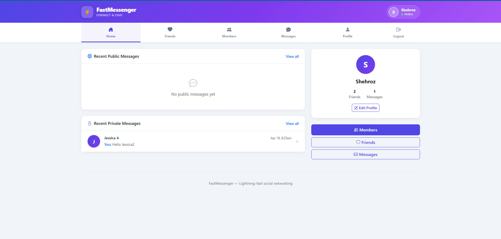
  <br/><sub><b>Home</b> — Recent public &amp; private message feed, clickable to open the conversation</sub>
</p>

<p align="center">
  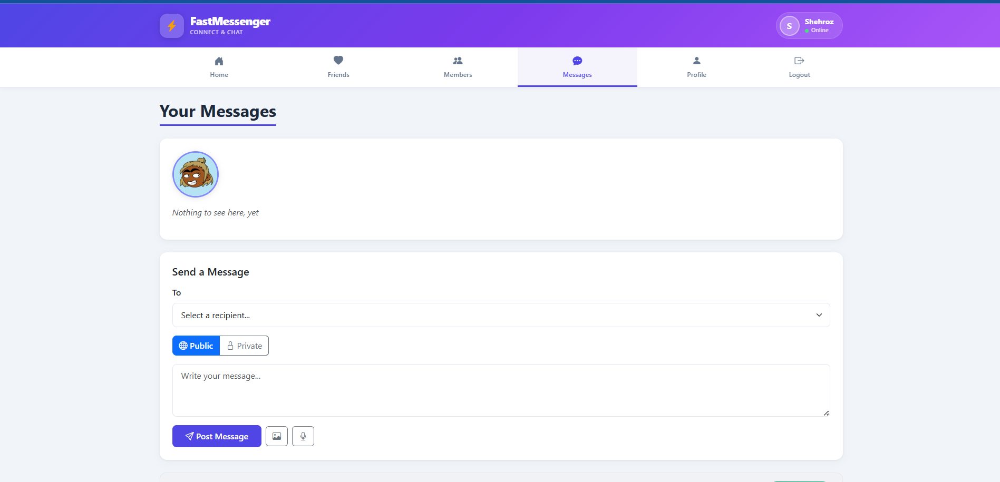
  <br/><sub><b>Chat</b> — Purple (sent) · White (received) · Green (private) bubbles with timestamps, voice &amp; image support</sub>
</p>

<p align="center">
  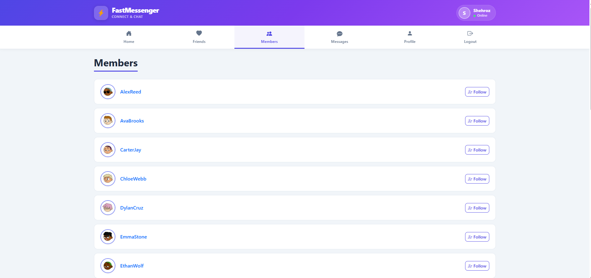
  <br/><sub><b>Members</b> — Browse all users with gender-aware avatars, follow/unfollow with Mutual · Following · Follows You badges</sub>
</p>

<p align="center">
  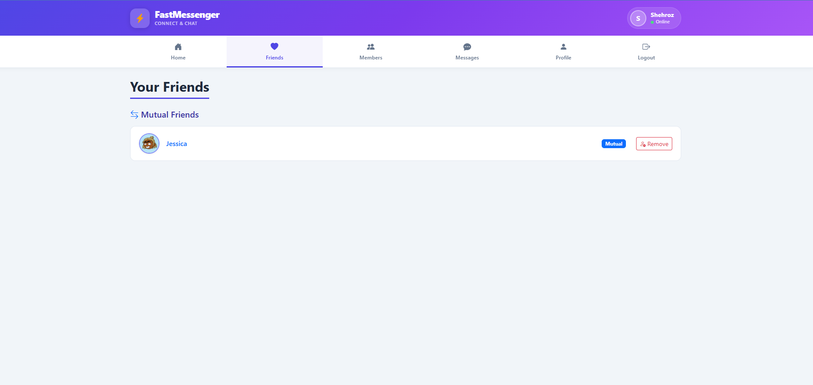
  <br/><sub><b>Friends</b> — Three sections: Mutual Friends · Your Followers · You are Following</sub>
</p>

<p align="center">
  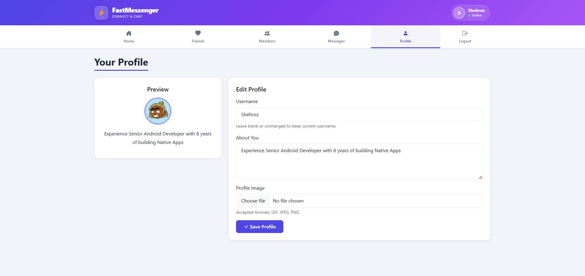
  <br/><sub><b>Profile</b> — Upload avatar (auto-resized, GIF/JPEG/PNG/WebP), write a bio, rename username (cascades across all tables)</sub>
</p>

<p align="center">
  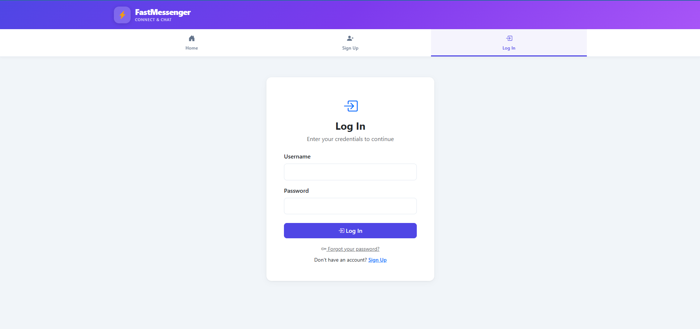
  <br/><sub><b>Login</b> — Clean auth card with bcrypt-verified credentials and forgot-password flow</sub>
</p>

<p align="center">
  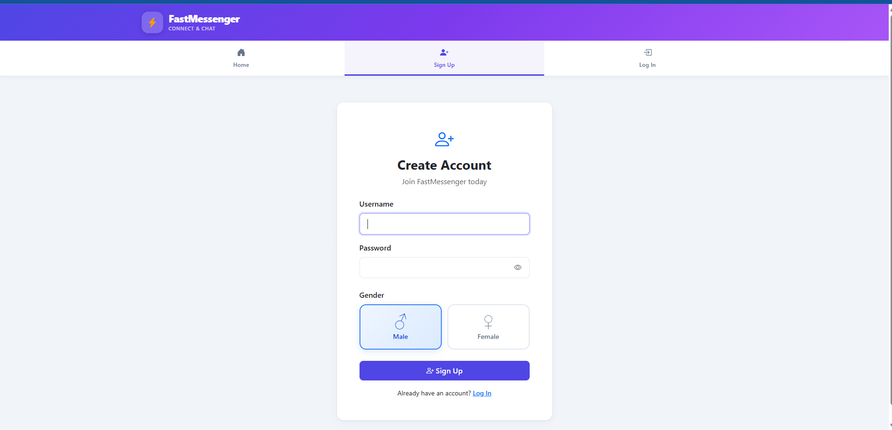
  <br/><sub><b>Sign Up</b> — Live username check, animated password strength popover &amp; gender selection with card-style radio buttons</sub>
</p>

<p align="center">
  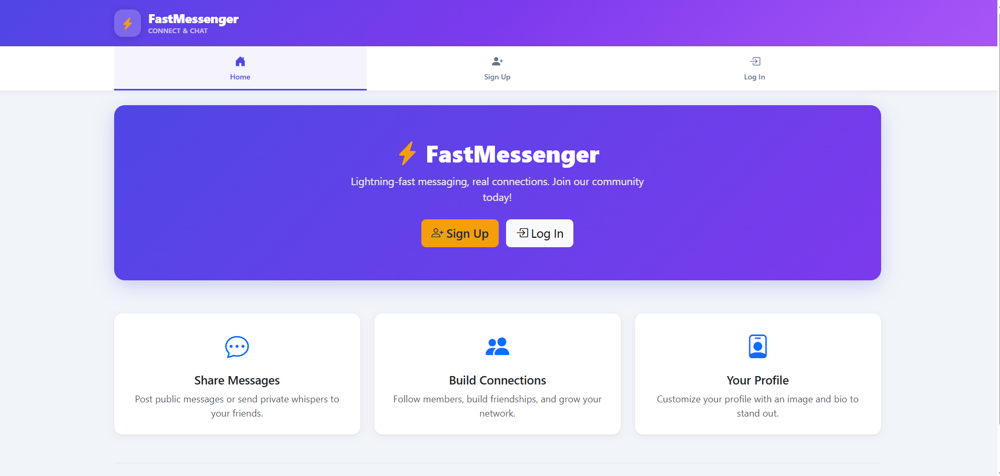
  <br/><sub><b>Welcome Modal</b> — Confetti, glowing check ring &amp; gradient card shown on first signup</sub>
</p>

---

## Features

| | Feature | Details |
|---|---|---|
| 🔐 | **Authentication** | Register · Login · Forgot / Reset password · bcrypt hashing · session regeneration |
| 💬 | **Real-time Chat** | AJAX polling every 3 s — no page reload, bubbles update live |
| ✏️ | **Edit Messages** | Edit any of your sent text messages; marked *edited* after saving |
| 🗑️ | **Delete Messages** | Delete your sent messages or messages received — with confirmation dialog |
| 🔒 | **Public & Private** | Toggle per message — private messages are green-tinted with a lock icon |
| 🖼️ | **Image Messages** | Attach GIF, JPEG, PNG, or WebP — renders inline inside the bubble |
| 🎙️ | **Voice Messages** | Record audio in the browser via MediaRecorder, send as a playable clip |
| 👥 | **Friend System** | Follow / unfollow any member · mutual detection · confirmation dialogs |
| 📝 | **Profiles** | Photo upload (GIF/JPEG/PNG/WebP, resized to 200 px), bio, username rename with DB transaction |
| 🚻 | **Gender** | Male / Female selected at signup · card-style radio buttons · gender-aware default avatars |
| 🖼️ | **Default Avatars** | Unique avatar per user · falls back to male/female placeholder based on gender |
| 🕒 | **Local Timestamps** | Message times displayed in the browser's local timezone — today shows time only, older shows date + time |
| 📱 | **Responsive UI** | Bootstrap 5 tab nav, sticky header, modals, works on mobile |
| 🛠️ | **Admin Tools** | DB setup, data cleanup, and full reset at `/admin/setup.php` (localhost-only) |

---

## Tech Stack

| Layer | Technology |
|---|---|
| Backend | PHP 8+ · PDO prepared statements |
| Database | MySQL / MariaDB · utf8mb4 |
| Frontend | Bootstrap 5.3.3 · Bootstrap Icons 1.11.3 |
| Real-time | AJAX fetch polling · FormData API |
| Media | Browser MediaRecorder API · PHP GD extension |
| Security | bcrypt · prepared statements · XSS output escaping · session regeneration |

---

## Quick Start

> Four commands from zero to running:

```bash
# 1. Clone into your web root
cd C:/xampp/htdocs
git clone <repository-url> robinsnest

# 2. Create upload directories
mkdir robinsnest/uploads robinsnest/uploads/messages

# 3. Import the database
mysql -u root -p < robinsnest/database.sql

# 4. Open in browser
start http://localhost/robinsnest
```

---

## Setup Guide

### Setup Flow

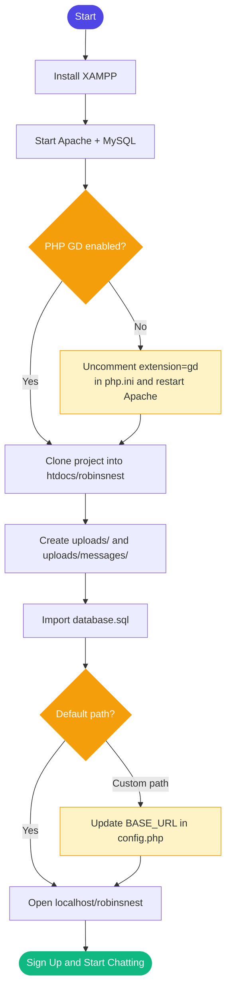

---

### Step 1 — Install XAMPP

Download from [apachefriends.org](https://www.apachefriends.org/) and install. Open the **XAMPP Control Panel** and start **Apache** and **MySQL**.

> Any Apache + PHP 8 + MySQL stack works — LAMP, MAMP, Docker, Laragon, etc.

---

### Step 2 — Enable the PHP GD Extension

GD is required to resize profile photos.

**Windows (XAMPP)** — open `C:\xampp\php\php.ini`, find and uncomment:
```ini
extension=gd
```
Then restart Apache.

**Linux:**
```bash
sudo apt install php-gd && sudo systemctl restart apache2
```

**Mac (MAMP):** GD is on by default.

---

### Step 3 — Clone the Project

```bash
# Windows
cd C:\xampp\htdocs
git clone <repository-url> robinsnest

# Linux
cd /var/www/html
git clone <repository-url> robinsnest

# Mac (MAMP)
cd /Applications/MAMP/htdocs
git clone <repository-url> robinsnest
```

No Git? Download the ZIP and extract it as `htdocs/robinsnest`.

---

### Step 4 — Create Upload Directories

Git does not track empty folders. Create them after cloning:

```bash
# Windows (PowerShell)
mkdir C:\xampp\htdocs\robinsnest\uploads
mkdir C:\xampp\htdocs\robinsnest\uploads\messages

# Linux / Mac
mkdir -p uploads/messages
chmod 755 uploads uploads/messages
```

---

### Step 5 — Set Up the Database

**Option A — Import the SQL file (recommended)**

```bash
mysql -u root -p < database.sql
```

Or in **phpMyAdmin**: Import → choose `database.sql` → Go.

**Option B — Browser installer**

If you already created the database and user manually, visit:
```
http://localhost/robinsnest/admin/setup.php
```

**Option C — Manual SQL**

```sql
CREATE DATABASE IF NOT EXISTS robinsnest
  CHARACTER SET utf8mb4 COLLATE utf8mb4_unicode_ci;

CREATE USER IF NOT EXISTS 'robinsnest'@'localhost' IDENTIFIED BY 'password';
GRANT ALL PRIVILEGES ON robinsnest.* TO 'robinsnest'@'localhost';
FLUSH PRIVILEGES;

USE robinsnest;

CREATE TABLE IF NOT EXISTS members (
    user   VARCHAR(16),
    pass   VARCHAR(255),
    email  VARCHAR(255),
    gender CHAR(1) NOT NULL DEFAULT 'M',
    INDEX(user(6))
) ENGINE=InnoDB DEFAULT CHARSET=utf8mb4;

CREATE TABLE IF NOT EXISTS messages (
    id      INT UNSIGNED AUTO_INCREMENT PRIMARY KEY,
    auth    VARCHAR(16), recip VARCHAR(16), pm CHAR(1),
    time    INT UNSIGNED, message VARCHAR(4096),
    image   VARCHAR(255), audio VARCHAR(255),
    edited  TINYINT(1) NOT NULL DEFAULT 0,
    INDEX(auth(6)), INDEX(recip(6))
) ENGINE=InnoDB DEFAULT CHARSET=utf8mb4;

CREATE TABLE IF NOT EXISTS friends (
    user VARCHAR(16), friend VARCHAR(16),
    INDEX(user(6)), INDEX(friend(6))
) ENGINE=InnoDB DEFAULT CHARSET=utf8mb4;

CREATE TABLE IF NOT EXISTS profiles (
    user VARCHAR(16), text VARCHAR(4096),
    INDEX(user(6))
) ENGINE=InnoDB DEFAULT CHARSET=utf8mb4;

CREATE TABLE IF NOT EXISTS password_resets (
    id INT UNSIGNED AUTO_INCREMENT PRIMARY KEY,
    user VARCHAR(16), token VARCHAR(64), expires INT UNSIGNED,
    INDEX(token(12))
) ENGINE=InnoDB DEFAULT CHARSET=utf8mb4;
```

---

### Step 6 — Configure (if needed)

**Database credentials** — `includes/functions.php`:
```php
$db_host = 'localhost';
$db_name = 'robinsnest';
$db_user = 'robinsnest';
$db_pass = 'password';
```

**Base URL** — `config.php` (only if your project is not at `/robinsnest/`):
```php
define('BASE_URL', '/robinsnest');
```

---

### Step 7 — Open the App

```
http://localhost/robinsnest/
```

Sign up and start messaging. To test the full chat experience, open a second incognito window and create another account.

---

## Project Structure

```
robinsnest/
│
├── config.php                 ← BASE_URL + ROOT_DIR constants
├── index.php                  ← Home / dashboard
├── database.sql               ← Full schema + seed script
│
├── includes/
│   ├── header.php             ← Session init, nav, tab bar, logout modal
│   └── functions.php          ← PDO connection, queryMysql(), showProfile(), helpers
│
├── auth/
│   ├── login.php              ← Login with bcrypt verify + session regeneration
│   ├── signup.php             ← Register, gender select, password strength + welcome modal
│   ├── logout.php             ← Session destroy + redirect
│   ├── forgot_password.php    ← Generate and display reset token
│   └── reset_password.php     ← Token-validated password reset
│
├── pages/
│   ├── messages.php           ← Chat: AJAX refresh, image/voice, edit, delete with confirm dialog
│   ├── members.php            ← Member list with gender-aware avatars, follow/unfollow
│   ├── friends.php            ← Mutual · Followers · Following sections with gender-aware avatars
│   └── profile.php            ← Avatar upload (GIF/JPEG/PNG/WebP), bio, username rename (transaction)
│
├── ajax/
│   ├── checkuser.php          ← Live username availability (signup)
│   └── edit_message.php       ← Save edited message text (auth-gated JSON endpoint)
│
├── admin/
│   └── setup.php              ← DB table creation, data cleanup, full reset (localhost only)
│
├── assets/css/
│   └── styles.css             ← Bubbles, tabs, cards, strength meter, gender selector styles
│
├── screenshots/               ← PNG screenshots used in this README
│
└── uploads/                   ← Runtime: profile photos + message attachments
    ├── default_male.jpg       ← Fallback avatar for male users
    ├── default_female.jpg     ← Fallback avatar for female users
    └── messages/
```

---

## Architecture

### Database Schema

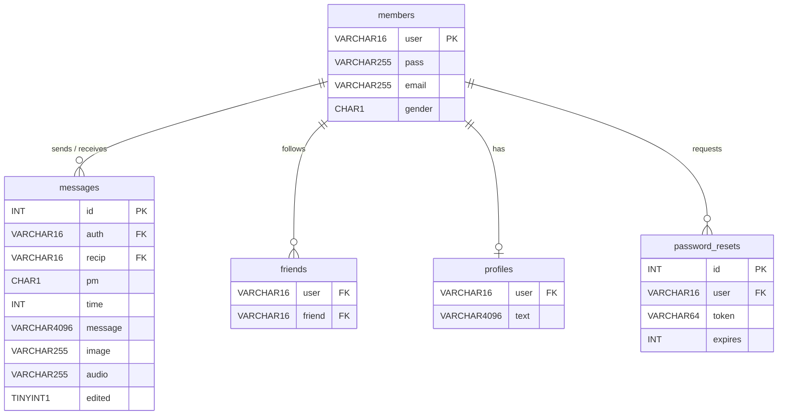

---

### System Architecture

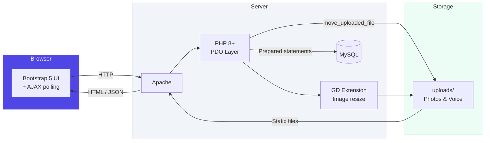

---

### Page Navigation

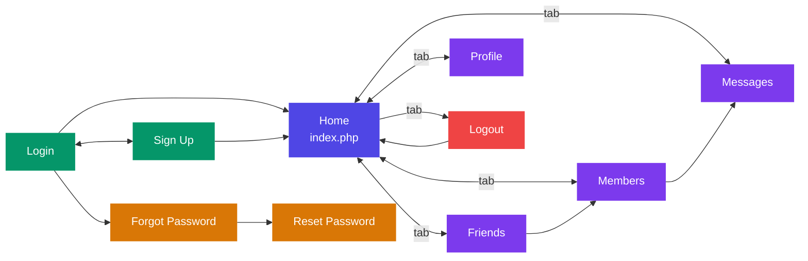

---

## How It Works

### Chat

- Your messages appear on the **right** in purple; others appear on the **left** in white
- Private messages are **green** with a lock icon; only visible to the two participants
- The chat window **auto-refreshes every 3 seconds** via AJAX — no full page reload
- Image and voice attachments render **inline** inside each bubble
- Each bubble shows a **timestamp** in your local timezone — time only for today, date + time for older messages
- **Edit any of your sent text messages** using the pencil icon; edited messages are labelled *edited*
- **Delete** your sent messages or messages received — a confirmation dialog prevents accidental deletion

### Friend System

- Follow any member from the **Members** page
- **Friends** page has three sections:
  - **Mutual Friends** — both of you follow each other
  - **Your Followers** — users who follow you
  - **You are Following** — users you follow
- Unfollow and Remove actions require a confirmation dialog

### Profiles

- Upload a photo (GIF, JPEG, PNG, or WebP) — auto-resized to **200 px**, saved as JPG
- No custom photo? A **gender-appropriate default avatar** is shown automatically
- Write a bio that appears on your profile card and your message wall
- **Rename your username** — a single DB transaction updates all five tables atomically

### Gender

- Selected at signup via card-style radio buttons: **♂ Male** (blue) / **♀ Female** (pink)
- Stored as `M` or `F` in the `members` table
- Used to pick the correct default avatar (`default_male.jpg` / `default_female.jpg`) when no custom photo is uploaded

---

## Database Cleanup

> ⚠️ `admin/setup.php` and `clean.php` are restricted to **localhost** only.

Visit `http://localhost/robinsnest/admin/setup.php` for one-click options:

| Button | Effect |
|---|---|
| **Clean Data** | Deletes messages, friends, profiles, resets — keeps member accounts |
| **Reset All** | Wipes everything including accounts |

Manual SQL:

```sql
-- Keep accounts, clear activity
DELETE FROM messages;
DELETE FROM friends;
DELETE FROM profiles;
DELETE FROM password_resets;

-- Full wipe
DELETE FROM messages;
DELETE FROM friends;
DELETE FROM profiles;
DELETE FROM password_resets;
DELETE FROM members;
```

---

## Troubleshooting

| Problem | Fix |
|---|---|
| `imagecreatefromjpeg()` undefined | Enable the GD extension — see Step 2 |
| "Invalid password" on fresh install | Run `admin/setup.php` to resize the `pass` column to VARCHAR(255) |
| Profile images not showing | Check that `uploads/` exists and Apache can write to it |
| Default avatars missing | Run `admin/setup.php` — it will note missing columns; download defaults via the seeder script |
| Voice recording not working | Microphone requires **HTTPS or localhost** — use a secure context |
| Gender column missing | Run: `ALTER TABLE members ADD COLUMN IF NOT EXISTS gender CHAR(1) NOT NULL DEFAULT 'M';` |
| Edited column missing | Run: `ALTER TABLE messages ADD COLUMN IF NOT EXISTS edited TINYINT(1) NOT NULL DEFAULT 0;` |
| CSS not updating | Hard-refresh with `Ctrl+Shift+R` — styles are cache-busted by default |
| Database connection error | Check credentials in `includes/functions.php` match your MySQL user |
| Broken links after moving | Update `BASE_URL` in `config.php` to match your new path |
| admin/setup.php returns 403 | It is restricted to localhost — access it from the same machine running XAMPP |
