<h1 align="center">⚡ FastMessenger</h1>

<p align="center">
  A modern PHP social messaging app with real-time chat, image &amp; voice messages, friend system, and a beautiful Bootstrap 5 UI.
</p>

<p align="center">
  
  
  
  
</p>

---

## Screenshots

<table>
  <tr>
    <td align="center" width="50%">
      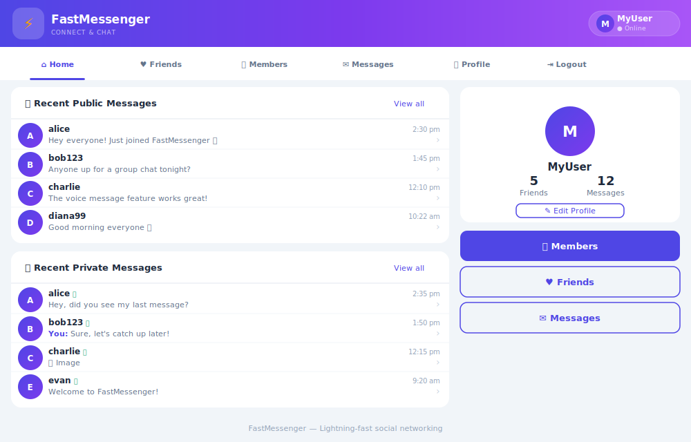
      <br/><sub><b>🏠 Home Dashboard</b> — Recent public &amp; private message feeds with profile sidebar</sub>
    </td>
    <td align="center" width="50%">
      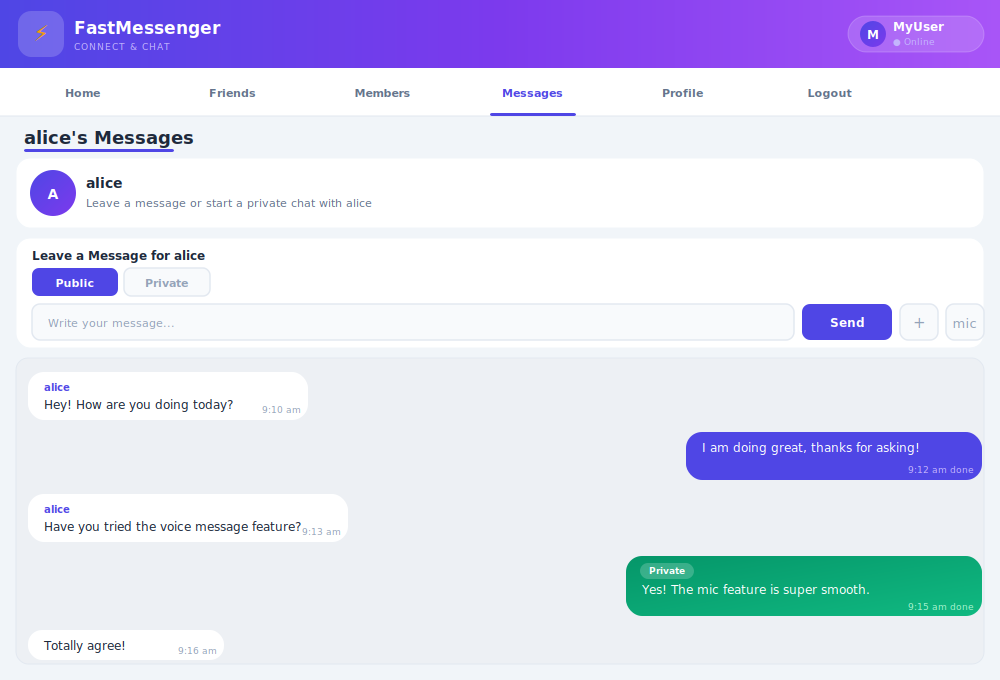
      <br/><sub><b>💬 Chat</b> — Real-time bubbles (purple sent · white received · green private), voice &amp; image</sub>
    </td>
  </tr>
  <tr>
    <td align="center" width="50%">
      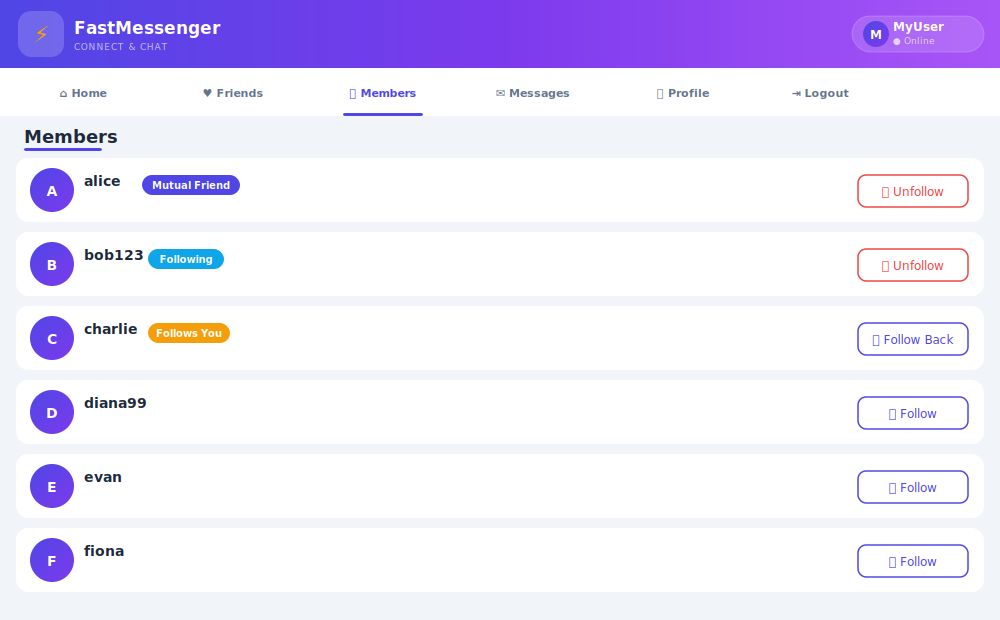
      <br/><sub><b>👥 Members</b> — Browse all users, follow/unfollow with Mutual · Following · Follows You badges</sub>
    </td>
    <td align="center" width="50%">
      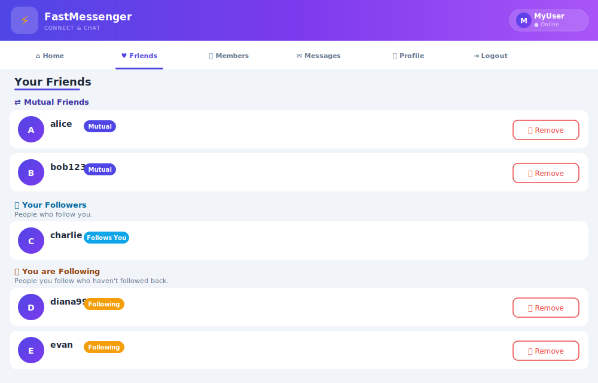
      <br/><sub><b>♥ Friends</b> — Three sections: Mutual Friends · Your Followers · You are Following</sub>
    </td>
  </tr>
  <tr>
    <td align="center" width="50%">
      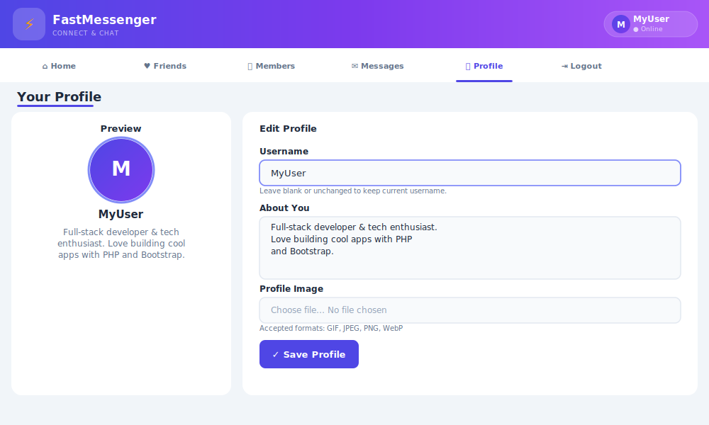
      <br/><sub><b>👤 Profile</b> — Edit username, bio and upload a profile photo with live preview</sub>
    </td>
    <td align="center" width="50%">
      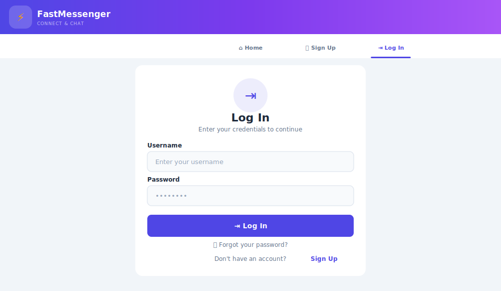
      <br/><sub><b>🔑 Login</b> — Clean auth card with bcrypt-verified credentials</sub>
    </td>
  </tr>
  <tr>
    <td align="center" width="50%">
      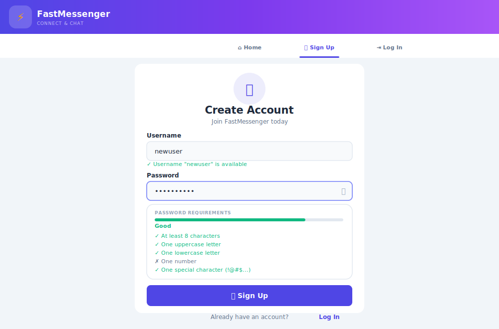
      <br/><sub><b>✨ Sign Up</b> — Live username check &amp; animated password-strength popover with 5-point checklist</sub>
    </td>
    <td align="center" width="50%">
      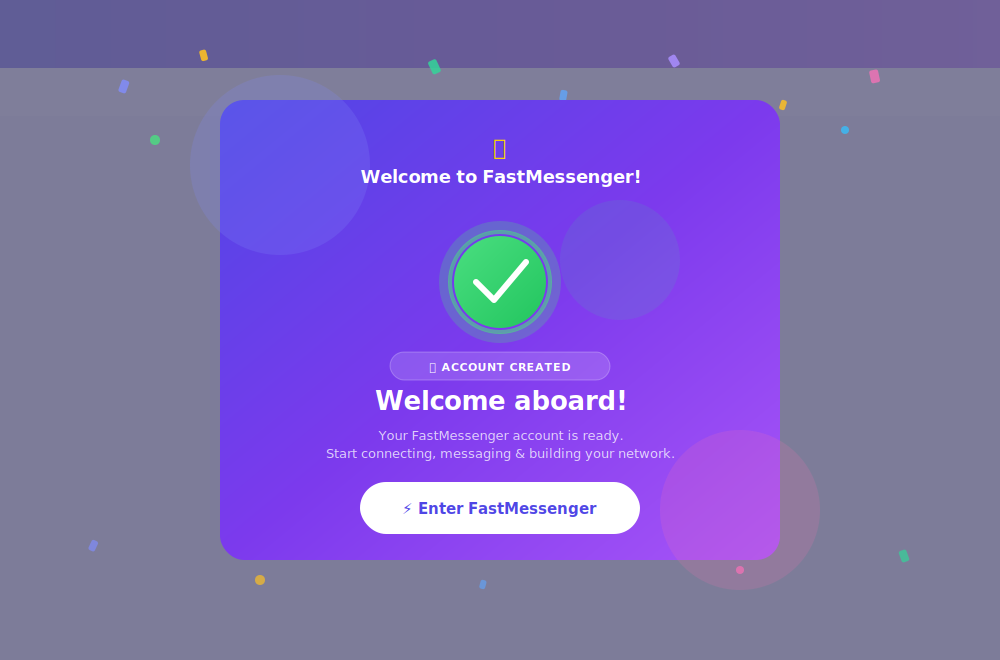
      <br/><sub><b>&#127881; Welcome Modal</b> — Animated confetti, glowing check ring &amp; gradient card on first signup</sub>
    </td>
  </tr>
</table>

---

## Features

| Feature | Description |
|---|---|
| 🔐 **Auth** | Register, login, forgot/reset password with bcrypt hashing |
| 💬 **Real-time Chat** | Chat bubbles (sent right, received left) with 3s AJAX auto-refresh |
| 🔒 **Public & Private** | Toggle between public wall posts and private direct messages |
| 🖼️ **Image Messages** | Attach GIF, JPEG, PNG, WebP images inline in chat |
| 🎙️ **Voice Messages** | Record and send voice notes using the browser microphone |
| 👥 **Friend System** | Follow/unfollow with mutual detection, confirmation dialogs |
| 📝 **Profiles** | Upload photo (auto-resized to 200px), write a bio, rename username |
| 📱 **Responsive UI** | Bootstrap 5 tab navigation, sticky header, modals, dark bubbles |
| 🛠️ **Admin Tools** | Browser-based DB setup, data cleanup and full reset |

---

## Tech Stack

| Layer | Technology |
|---|---|
| Backend | PHP 8+ · PDO prepared statements |
| Database | MySQL / MariaDB (utf8mb4) |
| Frontend | Bootstrap 5.3.3 · Bootstrap Icons 1.11.3 |
| Real-time | AJAX polling every 3 s · FormData API |
| Media | Browser MediaRecorder API · PHP GD extension |
| Security | bcrypt · prepared statements · XSS escaping |

---

## Quick Start

> **TL;DR** — 4 commands from zero to running:

```bash
# 1. Clone into XAMPP web root
cd C:/xampp/htdocs
git clone <repository-url> robinsnest

# 2. Create upload directories
mkdir robinsnest/uploads robinsnest/uploads/messages

# 3. Import the database (MySQL CLI)
mysql -u root -p < robinsnest/database.sql

# 4. Open in browser
start http://localhost/robinsnest
```

---

## Detailed Setup Guide

### Setup Flow

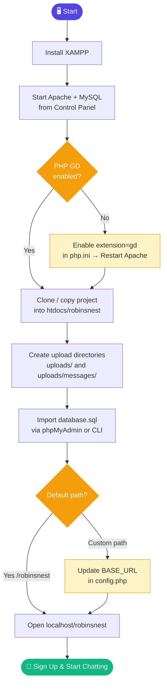

---

### Step 1 — Install XAMPP

Download and install XAMPP from [apachefriends.org](https://www.apachefriends.org/).

Open the **XAMPP Control Panel** and start both **Apache** and **MySQL**.

> **Linux/Mac alternative:** Any Apache + PHP + MySQL stack works — LAMP, MAMP, Docker, Laragon, etc.

---

### Step 2 — Enable PHP GD Extension

The GD extension is required for profile image resizing.

**Windows (XAMPP):**
```ini
; Open C:\xampp\php\php.ini
; Find this line and remove the semicolon:
extension=gd
```
Then restart Apache from the Control Panel.

**Linux:**
```bash
sudo apt install php-gd && sudo systemctl restart apache2
```

**Mac (MAMP):** GD is enabled by default.

---

### Step 3 — Clone the Project

```bash
# Windows
cd C:\xampp\htdocs
git clone <repository-url> robinsnest

# Linux
cd /var/www/html
git clone <repository-url> robinsnest

# Mac (MAMP)
cd /Applications/MAMP/htdocs
git clone <repository-url> robinsnest
```

> No Git? [Download the ZIP](../../archive/refs/heads/main.zip) and extract it as `htdocs/robinsnest`.

---

### Step 4 — Create Upload Directories

Git does not track empty directories. Create them manually after cloning:

```bash
# Windows (PowerShell)
mkdir C:\xampp\htdocs\robinsnest\uploads
mkdir C:\xampp\htdocs\robinsnest\uploads\messages

# Linux / Mac
cd /var/www/html/robinsnest   # or your MAMP path
mkdir -p uploads/messages
chmod 755 uploads uploads/messages
```

---

### Step 5 — Set Up the Database

**Option A — Import the SQL file (recommended):**

```bash
# CLI (run from the project folder)
mysql -u root -p < database.sql
```

Or in **phpMyAdmin** → open `http://localhost/phpmyadmin` → click **Import** → choose `database.sql` → click **Go**.

**Option B — Browser setup (tables only):**

If you already have the database and user, visit:
```
http://localhost/robinsnest/admin/setup.php
```

**Option C — Manual SQL:**

```sql
-- 1. Create database
CREATE DATABASE IF NOT EXISTS robinsnest
  CHARACTER SET utf8mb4 COLLATE utf8mb4_unicode_ci;

-- 2. Create user
CREATE USER IF NOT EXISTS 'robinsnest'@'localhost' IDENTIFIED BY 'password';
GRANT ALL PRIVILEGES ON robinsnest.* TO 'robinsnest'@'localhost';
FLUSH PRIVILEGES;

USE robinsnest;

-- 3. Tables
CREATE TABLE IF NOT EXISTS members (
    user VARCHAR(16), pass VARCHAR(255), email VARCHAR(255), INDEX(user(6))
) ENGINE=InnoDB DEFAULT CHARSET=utf8mb4;

CREATE TABLE IF NOT EXISTS messages (
    id INT UNSIGNED AUTO_INCREMENT PRIMARY KEY,
    auth VARCHAR(16), recip VARCHAR(16), pm CHAR(1),
    time INT UNSIGNED, message VARCHAR(4096),
    image VARCHAR(255), audio VARCHAR(255),
    INDEX(auth(6)), INDEX(recip(6))
) ENGINE=InnoDB DEFAULT CHARSET=utf8mb4;

CREATE TABLE IF NOT EXISTS friends (
    user VARCHAR(16), friend VARCHAR(16),
    INDEX(user(6)), INDEX(friend(6))
) ENGINE=InnoDB DEFAULT CHARSET=utf8mb4;

CREATE TABLE IF NOT EXISTS profiles (
    user VARCHAR(16), text VARCHAR(4096), INDEX(user(6))
) ENGINE=InnoDB DEFAULT CHARSET=utf8mb4;

CREATE TABLE IF NOT EXISTS password_resets (
    id INT UNSIGNED AUTO_INCREMENT PRIMARY KEY,
    user VARCHAR(16), token VARCHAR(64), expires INT UNSIGNED,
    INDEX(token(12))
) ENGINE=InnoDB DEFAULT CHARSET=utf8mb4;
```

---

### Step 6 — Configure (if needed)

**Database credentials** — open `includes/functions.php`:

```php
$db_host = 'localhost';
$db_name = 'robinsnest';
$db_user = 'robinsnest';   // MySQL username
$db_pass = 'password';     // MySQL password
```

**Base URL** — only needed if your project is NOT at `/robinsnest/`. Open `config.php`:

```php
define('BASE_URL', '/robinsnest');  // change to match your path
```

---

### Step 7 — Open the App

```
http://localhost/robinsnest/
```

Sign up for an account and start messaging!

> **Tip:** To test the full messaging experience, open a second browser (or incognito window), sign up with a different username, and chat between the two accounts.

---

## Project Structure

```
robinsnest/
│
├── config.php                    ← Base URL + DB constants
├── index.php                     ← Home / dashboard
├── database.sql                  ← Full SQL setup script
│
├── includes/
│   ├── header.php                ← Shared nav, tab bar, logout modal
│   └── functions.php             ← PDO connection + helper functions
│
├── auth/
│   ├── login.php                 ← Login with bcrypt verify
│   ├── signup.php                ← Register + password strength popover
│   ├── logout.php                ← Session destroy
│   ├── forgot_password.php       ← Generate reset token
│   └── reset_password.php        ← Token-validated password reset
│
├── pages/
│   ├── messages.php              ← Chat (AJAX, image, voice, public/private)
│   ├── members.php               ← Member list with follow/unfollow
│   ├── friends.php               ← Mutual · Followers · Following view
│   └── profile.php               ← Edit bio, avatar, username
│
├── ajax/
│   └── checkuser.php             ← Live username availability check
│
├── admin/
│   └── setup.php                 ← DB setup, clean data, full reset
│
├── assets/css/
│   └── styles.css                ← Chat bubbles, tabs, cards, strength meter
│
├── screenshots/                  ← UI mockups for README
│
└── uploads/                      ← Profile photos + message attachments
    └── messages/
```

---

## Architecture

### Database Schema

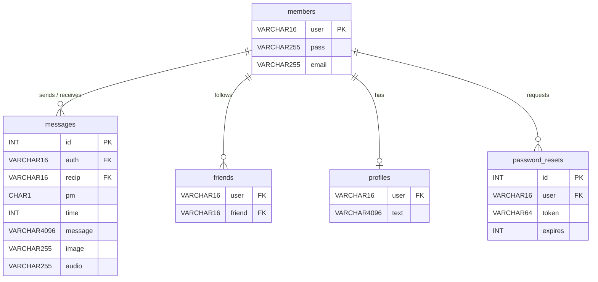

---

### System Architecture

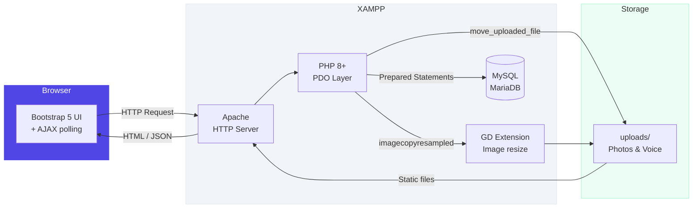

---

### Page Navigation Map

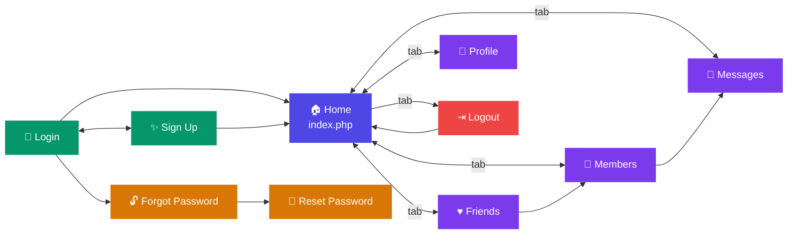

---

## How It Works

### Messaging
- Chat bubbles — your messages on the **right** (purple), others on the **left** (white)
- Private messages have a **green tint** + lock icon
- The chat window **auto-refreshes every 3 seconds** via AJAX — no page reload
- Image and voice attachments render **inline** inside bubbles
- After sending from your own page, you are **redirected** to the recipient's conversation

### Friend System
- Follow any member from the **Members** page
- Friends page shows **three sections**: Mutual Friends · Your Followers · You are Following
- Mutual = both follow each other
- Unfollow / Remove triggers a **Yes/No confirmation** modal

### Profiles
- Upload a photo → auto-resized to **200px max**, saved as JPG
- Write a bio shown on your profile card and message wall
- **Rename username** — cascades across all tables in a single DB transaction

---

## Database Cleanup

Visit `http://localhost/robinsnest/admin/setup.php` for one-click cleanup:

| Button | Effect |
|---|---|
| **Clean Data** | Deletes messages, friends, profiles & resets — keeps accounts |
| **Reset All** | Deletes everything including member accounts |

Or run in MySQL:

```sql
-- Keep accounts, clear everything else
DELETE FROM messages; DELETE FROM friends;
DELETE FROM profiles; DELETE FROM password_resets;

-- Full wipe
DELETE FROM messages; DELETE FROM friends;
DELETE FROM profiles; DELETE FROM password_resets; DELETE FROM members;
```

---

## Troubleshooting

| Problem | Solution |
|---|---|
| `imagecreatefromjpeg()` undefined | Enable the GD extension — see Step 2 |
| "Invalid password" after fresh setup | Visit `admin/setup.php` to upgrade the `pass` column to VARCHAR(255) |
| Profile images not showing | Ensure `uploads/` exists and Apache has write permission |
| Voice recording not working | Use **HTTPS or localhost** — microphone requires a secure context |
| CSS not updating | Hard-refresh with `Ctrl+Shift+R` — styles are cache-busted automatically |
| Database connection error | Check credentials in `includes/functions.php` match your MySQL user |
| Broken links after moving | Update `BASE_URL` in `config.php` to match your new path |
