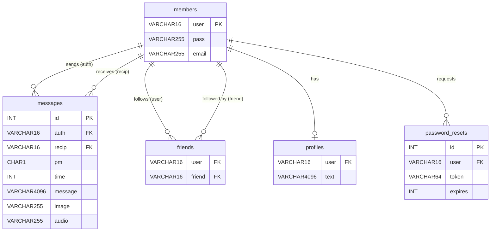
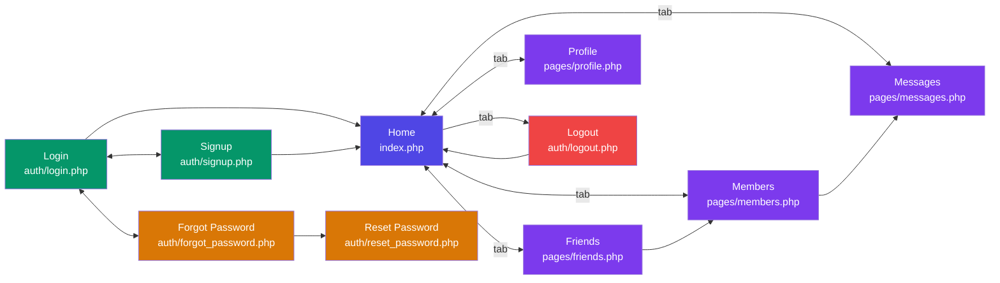

# FastMessenger

A modern PHP social messaging application with real-time chat, image & voice messages, built with Bootstrap 5 and AJAX.

## Features

- **User Accounts** — Registration with bcrypt password hashing, login, forgot/reset password
- **Real-time Chat** — Chat bubble layout (sender right, receiver left) with 3-second AJAX auto-refresh
- **Image Messages** — Attach and send images (GIF, JPEG, PNG, WebP) inline in chat
- **Voice Messages** — Record and send voice messages using browser microphone
- **Public & Private Messages** — Toggle between public wall posts and private direct messages
- **Friend System** — Follow/unfollow users with confirmation dialogs, mutual friend detection
- **User Profiles** — Upload profile photo (auto-resized), write a bio
- **Modern UI** — Responsive Bootstrap 5 design with tab navigation, modals, and active page indicators
- **Database Tools** — Built-in setup, cleanup, and full reset via browser

---

## Requirements

- **XAMPP** (or any Apache + PHP + MySQL stack)
- **PHP 8.0+** with GD extension enabled
- **MySQL / MariaDB**

---

## Step-by-Step Setup

### 1. Install XAMPP

Download and install XAMPP from https://www.apachefriends.org/

Start **Apache** and **MySQL** from the XAMPP Control Panel.

> **Linux/Mac alternative:** You can use any Apache + PHP + MySQL stack (LAMP, MAMP, Docker, etc.)

### 2. Enable PHP GD Extension

The GD extension is required for profile image uploads and resizing.

**Windows (XAMPP):**
1. Open `C:\xampp\php\php.ini`
2. Find the line `;extension=gd`
3. Remove the semicolon so it reads: `extension=gd`
4. Restart Apache from XAMPP Control Panel

**Linux:**
```bash
sudo apt install php-gd
sudo systemctl restart apache2
```

**Mac (MAMP):** GD is usually enabled by default.

### 3. Clone / Copy Project Files

Clone the repository or copy the project folder into your web root:

**Windows:**
```powershell
cd C:\xampp\htdocs
git clone <repository-url> robinsnest
```

**Linux:**
```bash
cd /var/www/html
git clone <repository-url> robinsnest
```

**Mac (MAMP):**
```bash
cd /Applications/MAMP/htdocs
git clone <repository-url> robinsnest
```

Or download the ZIP and extract it to one of the paths above.

### 4. Create Upload Directories

The app stores profile photos and message attachments in these folders. Git does not track empty directories, so create them manually after cloning:

**Windows (PowerShell):**
```powershell
mkdir C:\xampp\htdocs\robinsnest\uploads
mkdir C:\xampp\htdocs\robinsnest\uploads\messages
```

**Linux/Mac:**
```bash
cd /var/www/html/robinsnest
mkdir -p uploads/messages
chmod 755 uploads uploads/messages
```

### 5. Configure Database Credentials

Open `includes/functions.php` and verify these settings match your MySQL setup:

```php
$db_host = 'localhost';     // Database host
$db_name = 'robinsnest';   // Database name
$db_user = 'robinsnest';   // Database username
$db_pass = 'password';     // Database password
$db_chrs = 'utf8mb4';      // Character set
```

> **Note:** The default credentials assume a MySQL user `robinsnest` with password `password`. If you prefer different credentials, update them here **before** running the queries below (and adjust the SQL accordingly).

### 6. Set Up the Database

Open **phpMyAdmin** at http://localhost/phpmyadmin and go to the **SQL** tab (or use MySQL CLI). Run the following queries **in order**:

> **Quick alternative:** Instead of running these manually, you can import the included `database.sql` file which contains all queries below in one file:
> - **phpMyAdmin:** Open http://localhost/phpmyadmin → click **Import** tab → choose `database.sql` → click **Go**
> - **CLI (run from the project folder):** `mysql -u root -p < database.sql`
>
> Or, if the database and user already exist (steps 6.1–6.3), visit http://localhost/robinsnest/admin/setup.php to create just the tables from the browser.

#### 6.1 — Create the database

```sql
CREATE DATABASE IF NOT EXISTS robinsnest
  CHARACTER SET utf8mb4
  COLLATE utf8mb4_unicode_ci;
```

#### 6.2 — Create the database user and grant permissions

```sql
CREATE USER IF NOT EXISTS 'robinsnest'@'localhost'
  IDENTIFIED BY 'password';

GRANT ALL PRIVILEGES ON robinsnest.*
  TO 'robinsnest'@'localhost';

FLUSH PRIVILEGES;
```

#### 6.3 — Select the database

```sql
USE robinsnest;
```

#### 6.4 — Create the `members` table (user accounts)

```sql
CREATE TABLE IF NOT EXISTS members (
    user VARCHAR(16),
    pass VARCHAR(255),
    email VARCHAR(255),
    INDEX(user(6))
) ENGINE=InnoDB DEFAULT CHARSET=utf8mb4;
```

#### 6.5 — Create the `messages` table (public & private messages)

```sql
CREATE TABLE IF NOT EXISTS messages (
    id      INT UNSIGNED AUTO_INCREMENT PRIMARY KEY,
    auth    VARCHAR(16),
    recip   VARCHAR(16),
    pm      CHAR(1),
    time    INT UNSIGNED,
    message VARCHAR(4096),
    image   VARCHAR(255),
    audio   VARCHAR(255),
    INDEX(auth(6)),
    INDEX(recip(6))
) ENGINE=InnoDB DEFAULT CHARSET=utf8mb4;
```

#### 6.6 — Create the `friends` table (follow relationships)

```sql
CREATE TABLE IF NOT EXISTS friends (
    user    VARCHAR(16),
    friend  VARCHAR(16),
    INDEX(user(6)),
    INDEX(friend(6))
) ENGINE=InnoDB DEFAULT CHARSET=utf8mb4;
```

#### 6.7 — Create the `profiles` table (user bios)

```sql
CREATE TABLE IF NOT EXISTS profiles (
    user VARCHAR(16),
    text VARCHAR(4096),
    INDEX(user(6))
) ENGINE=InnoDB DEFAULT CHARSET=utf8mb4;
```

#### 6.8 — Create the `password_resets` table (reset tokens)

```sql
CREATE TABLE IF NOT EXISTS password_resets (
    id      INT UNSIGNED AUTO_INCREMENT PRIMARY KEY,
    user    VARCHAR(16),
    token   VARCHAR(64),
    expires INT UNSIGNED,
    INDEX(token(12))
) ENGINE=InnoDB DEFAULT CHARSET=utf8mb4;
```

> After running all queries you should see five tables in the `robinsnest` database: `members`, `messages`, `friends`, `profiles`, `password_resets`.

### 7. Configure Base URL (if not using default path)

If your project is NOT at `http://localhost/robinsnest/`, edit `config.php` and change the `BASE_URL` constant:

```php
define('BASE_URL', '/robinsnest');  // Change to match your path
```

For example, if you deploy to `http://localhost/messenger/`, set it to `'/messenger'`.

### 8. Launch the App

Open your browser and go to:

```
http://localhost/robinsnest/
```

Sign up for an account and start messaging!

> **Tip:** To test messaging, open a second browser (or incognito window), sign up with a different username, and send messages between the two accounts.

---

## Project Structure

```
robinsnest/
├── config.php                       (Base path constants)
├── index.php                        (Home / dashboard)
│
├── includes/
│   ├── header.php                   (Shared header, tab bar, logout modal)
│   └── functions.php                (Database connection & helper functions)
│
├── auth/
│   ├── login.php                    (Login page)
│   ├── signup.php                   (Registration with success dialog)
│   ├── logout.php                   (Logout handler)
│   ├── forgot_password.php          (Password reset request)
│   └── reset_password.php           (Password reset form)
│
├── pages/
│   ├── messages.php                 (Chat with image/voice/AJAX support)
│   ├── members.php                  (Member list with follow/unfollow dialogs)
│   ├── friends.php                  (Friends — mutual, followers, following)
│   └── profile.php                  (Profile editor & image upload)
│
├── ajax/
│   └── checkuser.php                (AJAX username availability check)
│
├── admin/
│   └── setup.php                    (Database setup & cleanup tools)
│
├── assets/
│   └── css/
│       └── styles.css               (Custom CSS — chat bubbles, tabs, cards)
│
├── uploads/                         (Profile images — created in Step 4)
│   └── messages/                    (Chat image & voice attachments)
│
├── database.sql                     (Full SQL setup script)
├── .gitignore
└── README.md
```

---

## Architecture Diagrams

### Database Schema



### Page Navigation Map

How users navigate between pages:



---

## How It Works

### Messaging
- Messages display in chat bubble format — your messages on the right (purple), others on the left (white)
- Private messages have a green tint with a lock icon
- Image and voice attachments display inline in bubbles
- The chat auto-refreshes every 3 seconds via AJAX (no page reload)
- Sending a message via AJAX keeps your scroll position and form state
- After sending from your own messages page, you are redirected to the recipient's conversation

### Friend System
- Follow any member from the Members page (shows a success dialog)
- Unfollow triggers a Yes/No confirmation dialog before removing
- Friends page shows three sections: Mutual Friends, Followers, Following

### Profiles
- Upload a profile image (auto-resized to 200px max, saved as JPG in `uploads/`)
- Write a bio displayed on your profile card
- Profile photos appear on member lists, friend lists, header bar, and home dashboard

---

## Database Cleanup

Visit http://localhost/robinsnest/admin/setup.php for cleanup buttons:

| Button | What it does |
|--------|-------------|
| **Clean Data** | Deletes messages, friends, profiles & resets (keeps member accounts) |
| **Reset All** | Deletes everything including member accounts |

Or run manually in MySQL:

```sql
-- Clean data only (keep accounts)
DELETE FROM messages;
DELETE FROM friends;
DELETE FROM profiles;
DELETE FROM password_resets;

-- Full reset (remove everything)
DELETE FROM messages;
DELETE FROM friends;
DELETE FROM profiles;
DELETE FROM password_resets;
DELETE FROM members;
```

---

## Troubleshooting

| Problem | Solution |
|---------|----------|
| **"Call to undefined function imagecreatefromjpeg()"** | Enable the GD extension (see Step 2) |
| **Login says "Invalid password" after setup** | Visit `admin/setup.php` to upgrade the `pass` column to VARCHAR(255) for bcrypt |
| **Profile images not showing** | Make sure the `uploads/` folder exists and is writable |
| **Voice recording not working** | Use HTTPS or localhost (microphone requires secure context). Allow mic permission in browser. |
| **CSS not updating after changes** | Hard refresh with Ctrl+Shift+R (CSS is cache-busted automatically via `?v=` timestamp) |
| **Database connection error** | Verify credentials in `includes/functions.php` match your MySQL user (see Step 5) |
| **Links broken after moving to different path** | Update `BASE_URL` in `config.php` to match your deployment path (see Step 7) |

---

## Tech Stack

| Layer     | Technology                                          |
|-----------|-----------------------------------------------------|
| Backend   | PHP 8+ with PDO (prepared statements)               |
| Database  | MySQL / MariaDB (utf8mb4)                           |
| Frontend  | Bootstrap 5.3.3, Bootstrap Icons 1.11.3             |
| Security  | bcrypt hashing, prepared statements, XSS protection |
| Real-time | AJAX polling (3s interval), FormData API            |
| Media     | Browser MediaRecorder API (voice), PHP GD (images)  |
